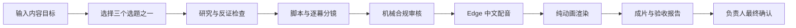

# 时宜 Agent 内容工厂 v0.3.0

面向除甲醛科普内容的 AI 短视频生产工具。普通用户选择一个选题后，可以一键完成研究、写稿、机械复核、中文配音、纯动画成片和验收报告；成片发布前仍需负责人确认品牌、科学与广告合规。

[](https://www.python.org/)
[](LICENSE)
[](https://github.com/zhichenghe34-design/clean-air-ai-content-factory/actions/workflows/ci.yml)
[](https://github.com/zhichenghe34-design/clean-air-ai-content-factory/releases/tag/v0.3.0)

| 版本 | 状态 | 说明 |
|---|---|---|
| v0.3.0 | 当前发布版 | 客户净包、纯动画主线、DeepSeek V4 Pro、一键安装与人类可读验收报告 |
| v0.2.0 | 历史稳定版 | 保留旧任务与历史证据，不再作为当前推荐版本 |

## Windows 一键使用

下载：

- [时宜 Agent 内容工厂 v0.3.0 Windows x64 客户版](https://github.com/zhichenghe34-design/clean-air-ai-content-factory/releases/download/v0.3.0/ShiyiContentFactory-v0.3.0-customer-clean-motion-9dac10f-Windows-x64.zip)
- [对应 FFmpeg LGPL 源码伴随包](https://github.com/zhichenghe34-design/clean-air-ai-content-factory/releases/download/v0.3.0/ShiyiContentFactory-v0.3.0-FFmpeg-LGPL-source-d3ad8a7.zip)

客户版信息：

- 文件大小：`239,560,933` bytes
- SHA-256：`CC9E98F1212FF7DDEDA30C849C2510E6CD19DED074A5317718F5C7A45181828E`
- 构建源码基线：`9dac10fc4c02094c86a44635347e7926aeb9e139`
- 平台：Windows 10/11 x64

使用步骤：

1. 完整解压 ZIP，不要直接在压缩软件里运行。
2. 双击 `安装到D盘.bat`。
3. D 盘满足固定磁盘、NTFS、可写且剩余空间不少于 2 GB 时，默认安装到 `D:\时宜Agent内容工厂\App`。
4. D 盘不满足条件时，安装器会说明原因并改用当前用户的 `LocalAppData\Programs\时宜Agent内容工厂\App`。
5. 打开安装目录，双击 `启动时宜Agent内容工厂.bat`。
6. 使用结束后双击 `关闭时宜Agent内容工厂.bat`，由启动器按进程身份安全停止。

程序和用户数据分开保存。任务、历史成片、设置以及 Windows DPAPI 加密后的 Key 位于 `%LOCALAPPDATA%\ShiyiContentFactory\UserData`；升级程序不会删除这份数据。

## v0.3.0 有什么

- **真正的一键成片**：输入目标、从三个选题中选择一个，系统自动完成后续研究、脚本、审核、配音和渲染。
- **DeepSeek V4 Pro 默认模型**：默认模型 ID 为 `deepseek-v4-pro`；用户自定义模型不会因只保存 Key 而被覆盖。
- **无 Key 也能试**：DeepSeek 未配置或暂时不可用时，系统使用本地安全候选和确定性内容路径，不伪造 Provider 成功记录。
- **失败原因与同题重试**：普通生成失败会显示可理解的原因，并可重新生成同一选题；精确改稿渲染失败时保留用户全文和上一版成功成片。
- **全文改稿再生成**：完成后可直接修改完整文案，系统重新做机械审查、分镜、配音和成片。
- **固定自然中文配音**：正式路径使用 `zh-CN-YunxiNeural / -2%`，逐幕合成并按真实 PCM 时长检查，不使用备用声音或整轨变速掩盖超时。
- **纯动画主线**：按当前旁白生成 4—8 幕内容驱动动画；字幕、卡片文字、配音和时间线由哈希绑定。
- **运营人员可读的验收报告**：完成页直接打开 `00-验收报告.html`；原始 JSON 只作为折叠的技术附件。
- **客户界面净化**：客户模式不显示内部能力目录、本地工具扫描、测试代理或开发诊断接口。
- **安全安装与升级**：安装前校验完整包；新版原子替换 App 并最多保留一个已验证回滚版本，UserData 独立保留。

## 当前产品边界

- 当前正式生产模式只有 `motion` 纯动画。
- “实拍素材”尚未形成可供运营人员使用的语义素材库，界面和 API 均禁用；不会用服务健康状态冒充功能已发布。
- 完整 DeepSeek 能力需要用户自己的 API Key；Key 不进入源码、任务公开证据或日志。
- Edge Neural TTS、联网研究和 DeepSeek 调用需要网络。
- 客户包内置 Python、Node.js、HyperFrames、FFmpeg/FFprobe 和字体，不依赖开发机的 Python、Node 或 FFmpeg。
- 目标电脑仍需 Windows PowerShell、系统安装的微软签名 Edge 151+，以及可用的 Windows Media Foundation H.264 编码能力。
- 本工具不自动发布账号内容，不自动点赞、关注或评论，也不绕过登录、验证码和平台限制。

## 一条视频怎样生成



系统区分执行授权、研究、内容、合规、渲染和完成状态。失败尝试使用独立 staging，不会替换上一份成功成片；只有清单、媒体和审核门禁全部通过的 render 才能成为当前正式运行。

## 产物与验收证据

一次成功的纯动画任务会生成并绑定以下主要产物：

```text
approved_script.json   当前批准文案
voice.wav              固定身份配音
captions.srt           逐幕字幕
motion_plan.json       动画时间线与分镜
final.mp4              最终成片
run_report.json        运行与媒体报告
approvals.json         阶段审查身份
manifest.json          文件大小与 SHA-256
contact-sheet.png      分幕接触表
visual-qc.json         视觉门禁结果
00-验收报告.html       面向运营人员的入口
VALIDATION.md          机器复算说明
```

公开证据 ZIP 采用扁平、安全、离线可读的文件结构。`00-验收报告.html` 可以直接播放同目录成片、查看完整文案和关键指标；技术 JSON 默认折叠，不要求运营人员阅读源码或清单结构。

## 本次发布验证

v0.3.0 客户包在发布前完成了以下验证：

- 当前 538 项 Python 测试：`538 passed, 13 skipped`
- JavaScript 语法检查通过
- 客户包目录与 ZIP：`COMBINED_PORTABLE_OK`
- 全新中文、空格及 `&` 物理路径冷启动通过
- 无 Key、无人工中途介入的一键成片通过
- 真实样片：8 幕、51.766667 秒、1080×1920、30fps、H.264/AAC
- 固定配音：`zh-CN-YunxiNeural / -2%`，总长 51.746 秒，逐幕最高 4.032 字/秒
- 音视频时长差 0，全流严格解码通过，无黑场、长静音或 2 秒以上冻结
- 公开证据：`PUBLIC_EVIDENCE_OK`
- 安装器：15/15；D 盘真实升级和同版本幂等复验通过
- 正式停止后端口、进程、状态文件和临时虚拟盘均完成收口

机器验证不能替代负责人对品牌、科学、广告合规和最终观看体验的确认。

## 源码开发

源码开发需要 Python 3.12 或 3.14、Node.js 和 FFmpeg/FFprobe。客户包使用的是独立冻结运行时，不会从本源码目录读取依赖。

```powershell
python -m venv .venv
.\.venv\Scripts\python.exe -m pip install -r requirements.txt -r requirements-dev.txt
npm.cmd ci
.\.venv\Scripts\python.exe app.py --host 127.0.0.1 --port 8765 --open
```

常用验证：

```powershell
.\.venv\Scripts\python.exe -B -m unittest discover -s tests -v
npm.cmd run check:js
npm.cmd audit --audit-level=low
npm.cmd run test:smoke
npm.cmd run test:flow
```

## 源码 API 与历史兼容口径

- 当前源码架构简称 `v3`；源码工作台默认地址是 `127.0.0.1:8765`。
- 首页选题接口为 `/api/agent/topics`，每轮返回恰好三个候选。
- v2 的 **13 个本地工具能力包**属于冻结的历史比赛事实，不代表客户电脑已经安装这些工具，客户界面不会展示该目录。
- **动态行业能力包**只保留为开发实验路径；v0.3.0 正式主链使用本地确定性安全能力包。
- 历史任务统一标记为 `legacy_read_only`，不会被新版状态机或产物接口改写。

## 进一步阅读

- [通用 Agent 内核](docs/GENERAL_AGENT_KERNEL.md)
- [生产引擎与纯动画主线](docs/PRODUCTION_ENGINE_INTEGRATION.md)
- [系统架构](docs/ARCHITECTURE.md)
- [安全边界](docs/SAFETY.md)
- [v2 真实联调与历史证据](docs/REAL_E2E_VALIDATION.md)
- [第三方 FFmpeg 构建与许可证](third_party/ffmpeg/README.md)
- [HyperFrames 依赖与 Windows MF 适配](third_party/hyperframes/README.md)

## 许可证与合规

本仓库第一方代码使用 [MIT License](LICENSE)。客户包中的第三方组件保留各自许可证与来源信息；FFmpeg 对象代码包与 LGPL 源码伴随包在同一个 v0.3.0 Release 中提供。

本项目是内容生产与审核原型，不构成医学、健康、投资或法律建议，也不构成任何产品功效、检测结论、认证或排名证明。涉及除甲醛、母婴、健康和广告宣称的事实必须回指可核验材料，并由负责人最终确认。
