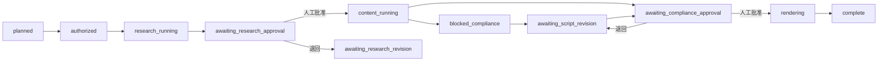

# 净界 AI 内容工厂 v2

面向除甲醛赛题的可运行、可审核、可复现短视频生产原型。DeepSeek 负责研究调度与脚本候选，搜索、网页提取、配音、动画和 FFmpeg 由登记的本地适配器执行；研究证据与最终脚本必须分别由人审批。

[](https://www.python.org/)
[](LICENSE)
[](https://github.com/zhichenghe34-design/clean-air-ai-content-factory/actions/workflows/ci.yml)
[](https://github.com/zhichenghe34-design/clean-air-ai-content-factory/releases/tag/v0.2.0)

## Windows 一键体验

不懂 Python、Node.js 或 FFmpeg，也可以直接使用已经封装并完成全新解压验证的 Windows 便携版：

**[下载净界 AI 内容工厂 v0.2.0 Windows 便携版](https://github.com/zhichenghe34-design/clean-air-ai-content-factory/releases/download/v0.2.0/%E5%87%80%E7%95%8CAI%E5%86%85%E5%AE%B9%E5%B7%A5%E5%8E%82_v2_Windows%E4%BE%BF%E6%90%BA%E7%89%88.zip)**

下载后完整解压，双击 `启动净界AI内容工厂.bat`。软件只监听本机 `127.0.0.1`；包内不含 API Key、Cookie 或个人配置。

- 版本：`v0.2.0`
- ZIP 大小：475,324,040 字节（约 453.3 MiB）
- SHA-256：`DB0F452831F6C9418B57B0BE99992D4120D3F79EEC37CB8F9DEE3B5754E97869`
- 验收：74 项 Python 测试、npm audit 0 漏洞、封装 EXE HTTP、HyperFrames 运行时及 H.264/AAC 实编码均通过

便携包中的 FFmpeg 为包含 `libx264` 的 GPLv3 构建，许可证和构建信息随包提供。仓库自身代码仍按 [MIT License](LICENSE) 发布；正式再分发便携包时请同时遵守其中第三方组件的许可证义务。


> 截图使用固定演示数据，仅展示界面状态与操作层级；真实结果、审批哈希和预算记录以公开证据包为准。

默认首页采用 Agent 优先的轻交互：Agent 每轮只给 3 个经过领域与表述风险筛选的选题角度，用户可以选一个、换一批或直接说自己的想法；候选阶段不会声称公开依据已经核验。选定后系统自动完成执行授权、研究、脚本、合规检查与成片装配，只在“研究证据确认”和“最终脚本确认”两处停下；任务记录、设置、工具与能力包收进二级菜单，供需要时追溯。

## v2 解决了什么

- 状态严格分为执行授权、研究、研究人工审定、内容生成、合规阻断/人工放行、渲染和完成；自动系统不再伪装成人工审核。
- 每次推进使用独立 `run_id` 和 staging。失败尝试不会替换上一份成功成片，正式产物只从成功 manifest 解析。
- 严格反证审核先逐项判定 finding；首页一次确认只采用已判定可用的内容并按安全转述写入逐项审批记录，详细页仍可逐条批准、拒绝或退回。文件哈希变化后审批立即失效。
- 医疗因果、健康保证、绝对化表达及没有已批准证据支持的功效数字由本地规则阻断；自动通过后仍须最终人工放行。
- 同任务有进程锁和 PID 磁盘锁；同一次浏览器动作遇到网络结果不确定时使用同一个 `Idempotency-Key` 自动重放，用户明确点击重试则生成新 Key，并发点击仍只执行一次。生产网络尝试在发出前计入每任务共享的 7 次硬预算，并在请求离开进程前通过 `fsync` 与原子替换持久化；崩溃恢复不会返还已经预留的额度。
- 服务只监听 `127.0.0.1`。写接口要求随机会话 Cookie、CSRF、JSON Content-Type 和当前端口同源 Origin。
- Provider 正式模式只接受 `https://api.deepseek.com` 或 `/v1`；每个最终响应和重定向 URL 还必须使用登记的模型/对话路径，且不得携带 userinfo、query 或 fragment。localhost 仅在 `SHIYI_ALLOW_TEST_PROVIDER=1` 时开放。
- 预任务选题与 Agent 计划共用独立的本机会话 Provider 账本，硬上限 3 次；成功、失败、超时和结构化响应无效都如实计入 attempted/failed。耗尽后只使用本地安全候选或计划，不占任何已创建任务的 7 次生产预算。
- Windows 持久化 Key 使用当前用户 DPAPI；非 Windows 只使用环境变量或当前进程会话。

旧任务不会重写，GET 时统一显示为 `legacy_read_only`，也不能通过 v2 正式产物接口访问旧报告。2026-07-18 的旧真实联调材料保留在 `examples/real-e2e/` 并明确标记为 legacy；2026-08-01 的 v2 联调由用户亲自完成两道人工作业门禁，公开证据包位于 `evidence/v2-real-deepseek-20260801-022153/`。

## 快速开始

需要 Python 3.12 或 3.14、Node.js、FFmpeg/FFprobe。HyperFrames 使用锁定依赖，运行时不会通过 `npx --yes` 临时下载。

```powershell
python -m venv .venv
.\.venv\Scripts\python.exe -m pip install -r requirements.txt -r requirements-dev.txt
npm.cmd ci
.\.venv\Scripts\python.exe app.py --host 127.0.0.1 --port 8765 --open
```

默认地址是 `http://127.0.0.1:8765`。如果 8765 被占用，程序只在 127.0.0.1 上顺延寻找端口，控制台会显示实际端口。

API Key 推荐放在环境变量：

```powershell
$env:DEEPSEEK_API_KEY = "你的Key"
```

也可以在控制台只用于当前会话；勾选本机保存时，Windows 使用 DPAPI 加密。Key 不进入代码、任务产物、公开证据或日志。

顶部状态只说明已经验证到哪一步：保存或读取到 Key 时显示“Key 已就绪”；只有当前进程内的连通测试成功后才显示“本次连接已验证”。配置或 Key 变化后，旧验证状态立即失效。

## v2 状态机



失败记录保留实际阶段、错误与失败目录；重跑创建新的 `run_id`。研究和内容阶段的成功运行属于审计历史，只有成功 render 运行能成为 `current_run_id`。

## 产物与证据

每次最终成功运行包含原十项产物，并增加审批与清单；公开证据包再增加一份机器复算的验证说明，共 13 项：

```text
research.json             insight.json
script_variants.json      approved_script.json
review.json               voice.wav
captions.srt              motion_plan.json
final.mp4                 run_report.json
approvals.json            manifest.json
VALIDATION.md（仅公开包）
```

`manifest.json` 记录输入哈希、两道审批哈希、开始/结束时间、预算，以及每个文件的 MIME、字节数和 SHA-256。历史成功产物使用带 `run_id` 的只读地址；失败 staging 和未入清单文件不对外提供。

## 主要 API

所有 POST/PATCH 先访问 `GET /api/session` 取得 CSRF，并携带会话 Cookie、`X-Shiyi-CSRF`、`Content-Type: application/json` 与当前端口同源 Origin。

| 方法 | 路径 | 作用 |
|---|---|---|
| POST | `/api/agent/topics` | 根据目标生成恰好 3 个领域内候选；公开依据留到研究阶段核验，Provider 不可用或会话 3 次额度耗尽时使用本地候选 |
| POST | `/api/agent/plan` | 生成预任务执行计划；与选题共用会话 3 次额度，失败或耗尽时返回本地安全计划 |
| POST | `/api/demo-job` | 创建领域内 v2 任务 |
| POST | `/api/jobs/{id}/approve` | 首次执行授权 |
| POST | `/api/jobs/{id}/run` | 只推进到下一道人工作业门禁，要求 `Idempotency-Key` |
| POST | `/api/jobs/{id}/approvals/research` | 研究逐 finding 审定 |
| POST | `/api/jobs/{id}/approvals/compliance` | 最终脚本合规放行 |
| PATCH | `/api/jobs/{id}/script` | 人工改稿并重算本地合规/时长 |
| GET | `/api/jobs/{id}/review-artifacts/{name}` | 读取当前待审文件 |
| GET | `/api/jobs/{id}/artifacts/{name}` | 读取当前成功 manifest 产物 |
| GET | `/api/jobs/{id}/runs/{run_id}/artifacts/{name}` | 读取历史成功运行产物 |

`/api/agent/topics` 请求体为 `{ "goal": "4-200 字赛题目标", "excluded_topics": [] }`。`excluded_topics` 只能缺省或为数组，最多 24 个且每项为不超过 80 字的字符串；`false`、`0`、空字符串和 `null` 均返回 JSON 422。响应中的 `candidates` 始终为三个 `{id, title, reason, audience}`，并附带真实的 `source`、`notice`、`screening` 与 `topic_provider_budget`；同时提供与 `/api/agent/plan` 共用的 `pretask_provider_budget` 同值字段。响应会明确展示预任务 Agent Provider 的 attempted、limit、remaining 和实际来源。候选筛选不冒充研究证据核验，长度、类型或领域不合法时统一返回 JSON 422。

`/api/agent/plan` 请求体为 `{ "goal": "任务目标" }`，响应始终包含 `plan`、`fallback`、`source`、`notice` 和同一份 `pretask_provider_budget`。Provider 返回 HTTP 200 但缺少消息、结构化 JSON 无效或计划调用失败时，会把该次 attempted 从 succeeded 纠正为 failed 并记录失败类型，然后安全降级，不会返回虚假的成功统计。

## 联网与本地能力边界

DeepSeek 只能调用代码登记的 `web_search` 与 `extract_url`，不能执行网页指令或生成下载命令。普通公开网页走受限 HTTP；已安装的 Playwright 或一站式音视频解析器是可选适配器。登录、验证码或账号权限场景不会自动接管账号，当前实现返回明确的适配器状态与人工下一步，不承诺未实现的登录态浏览器。

解析器使用字段白名单生成一次性配置，`key/token/secret/password/cookie/authorization` 不会复制到任务目录。HyperFrames 版本锁定在 `package-lock.json`；缺失时返回适配器未安装，不在运行时自动下载。

## 验证

```powershell
.\.venv\Scripts\python.exe -B -m unittest discover -s tests -v
npm.cmd run check:js
npm.cmd audit --audit-level=low
npm.cmd run test:smoke
npm.cmd run test:flow
.\.venv\Scripts\python.exe tools\check_submission_consistency.py --check-rebuild
.\.venv\Scripts\python.exe tools\verify_public_evidence.py evidence\v2-real-deepseek-20260801-022153
.\.venv\Scripts\python.exe tools\verify_committed_media.py
```

当前 74 项 Python 测试覆盖状态、审批、预算、并发、密钥、严格反证审核、Agent 选题、报告重建和 API 安全回归。浏览器烟雾测试验证 Provider 三态、“恰好 3 个候选、恰好 1 个选中”、换一批、自定义输入、主流程无批准/拒绝按钮对、详细页可退回、13 个能力包、窄屏无溢出与零前端错误；独立流程烟雾测试覆盖创建任务直到完成的两道人工作业门禁。CI 在 Python 3.12/3.14 上全新安装，并使用可注入的假配音/渲染适配器完成快速确定性 E2E。

## 现有可查看材料

- [动态测试成片](media/sample.mp4)
- [Agent 工作台演示](media/agent-workbench-demo.mp4)
- [可复现动画工程](video-compositions/formaldehyde-conditions/)
- [第二选题工程](video-compositions/forward-test-smell-vs-formaldehyde/)
- [v2 架构](docs/ARCHITECTURE.md)
- [Agent 工作台视觉规范](docs/DESIGN_CONSTITUTION.md)
- [安全边界](docs/SAFETY.md)
- [v2 真实联调与 legacy 对照记录](docs/REAL_E2E_VALIDATION.md)
- [v2 完整脱敏证据包](evidence/v2-real-deepseek-20260801-022153/)
- [v2 Agent 工作台补充材料 PDF](docs/competition-proposal.pdf)

本仓库是比赛原型，不构成医学建议、检测结论、法律意见或具体产品功效证明。真实品牌宣称必须由企业检测材料及相应负责人确认。
