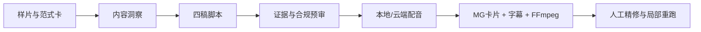

# 净界AI内容工厂 / CleanAir Content Factory

> 面向除甲醛健康科普的可审计 AIGC 短视频生产线：内容洞察 → 四稿脚本 → 证据与广告合规预审 → 本地配音 → 竖屏合成 → 人工精修。

[](https://www.python.org/)
[](LICENSE)
[](https://github.com/zhichenghe34-design/clean-air-ai-content-factory/actions/workflows/ci.yml)
[](docs/SAFETY.md)


## 为什么做

除甲醛产品依赖短视频种草，但一条成片常需1–2天，质量依赖个人经验，健康科普又不能牺牲科学与广告合规。本项目不是再造一个孤立的“爆款打分器”，而是把样片范式、脚本候选、证据边界、本地语音和自动合成组织成一条可复核、可修改、可局部重跑的生产线。

首个验证选题：**“99%除醛率为什么必须看检测条件？”**

- 首次选题到成片：**166.88秒**
- 人工精修后的局部重跑：**5.38秒**
- 成片：**46.1秒 / 1080×1920 / H.264 + AAC**
- 脚本：一次生成4稿，内部代理测试2/4进入可用候选
- 测试：12项单元测试和浏览器烟雾测试通过
- 付费API：本次验证0次，完整离线降级仍可运行

> 2/4是内部原型指标，不冒充企业运营采用率；具体产品功效必须由品牌检测材料支持。

## 可查看成果

- [首条测试成片](media/sample.mp4)
- [控制台演示](media/console-demo.mp4)
- [8页初赛方案PDF](docs/competition-proposal.pdf)
- [结构化运行报告](examples/demo-output/run_report.json)
- [合规预审结果](examples/demo-output/review.json)
- [四个脚本候选](examples/demo-output/script_variants.json)


## 六阶段架构



每个任务都会留下八类可审计产物：

```text
insight.json
script_variants.json
approved_script.json
review.json
voice.wav
captions.srt
final.mp4
run_report.json
```

## 快速开始

要求：Python 3.10+、FFmpeg与FFprobe。Windows用户可直接运行：

```powershell
.\run.ps1
```

或手动启动：

```powershell
python -m venv .venv
.\.venv\Scripts\python.exe -m pip install -r requirements.txt
.\.venv\Scripts\python.exe app.py --open
```

默认访问 `http://127.0.0.1:8765`，点击“创建样片任务”即可生成固定演示任务。

### DeepSeek与本地工具

- 不配置Key：使用确定性四稿和本地规则审核，仍能演示完整流程。
- 配置DeepSeek：将Key放在环境变量 `DEEPSEEK_API_KEY`，不要写进代码。
- FFmpeg不在PATH：设置 `FFMPEG_PATH` 和 `FFPROBE_PATH`。
- 本地语音工作台：设置 `VOICE_WORKBENCH` 与 `VOICE_REFERENCE`；不可用时Windows会降级到SAPI。

完整变量见 [.env.example](.env.example)。

## API

| 方法 | 路径 | 作用 |
|---|---|---|
| POST | `/api/demo-job` | 创建固定演示任务 |
| GET | `/api/jobs/{id}` | 查询阶段、日志和产物 |
| POST | `/api/jobs/{id}/run` | 运行受信生产适配器 |
| PATCH | `/api/jobs/{id}/script` | 保存人工修改脚本 |
| GET | `/api/jobs/{id}/artifacts/{name}` | 预览或下载产物 |
| GET | `/api/catalog` | 只读能力目录 |
| GET | `/api/hardware` | 只读硬件探测 |

## 安全与合规设计

- Agent只调用代码中登记的受信适配器，不能提交任意网址或命令。
- 自动下载安装默认关闭；外部能力必须固定来源、版本、哈希和许可。
- 拦截“绝对安全、完全去除、母婴零风险”等无证据表述。
- 百分比功效必须检查测量对象、空间体积、作用时间、初始浓度、检测方法和报告来源。
- 没有品牌检测报告时只做通用科普，不输出具体产品功效承诺。

详见 [安全边界](docs/SAFETY.md)。依据包括 [GB/T 18883-2022《室内空气质量标准》](https://openstd.samr.gov.cn/bzgk/std/newGbInfo?hcno=6188E23AE55E8F557043401FC2EDC436)、[《中华人民共和国广告法》](https://www.samr.gov.cn/zw/zfxxgk/fdzdgknr/fgs/art/2023/art_5474cf75173c45d6a0379730fb4e8d97.html)及[广告绝对化用语执法指南](https://www.samr.gov.cn/ggjgs/tzgg/art/2023/art_183b5cb48d9e4f0dba67f9f912a913ba.html)。

## 验证结果

```powershell
python -m unittest discover -s tests -v
node --check static/app.js
```

当前基线：12项单元测试全部通过；浏览器烟雾测试无控制台错误；首条成片包含正常视频流、音频流和字幕边车文件。

## 项目结构

```text
core/                 任务、Provider、生产适配器与安全目录
static/               无框架可视化控制台
catalog/              受信能力包目录
examples/             范式卡与一次真实运行的结构化产物
media/                首条成片与控制台Demo
docs/                 架构、安全说明、截图与初赛方案
tests/                 单元测试与浏览器烟雾测试
app.py                 本地HTTP入口
```

## 下一阶段

1. 接入品牌事实库、检测报告、允许宣称与禁用宣称。
2. 在企业真实账号中验证采用率、修改量、合规命中和多账号产能。
3. 增加素材授权台账、人工审批流和可插拔视频/语音适配器。
4. 将“小时级”目标从单机原型扩展到稳定批量生产。

本仓库是比赛原型，不构成医学建议、检测结论或具体产品功效证明。
