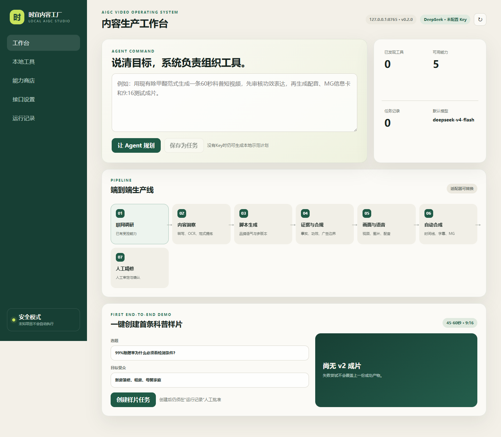
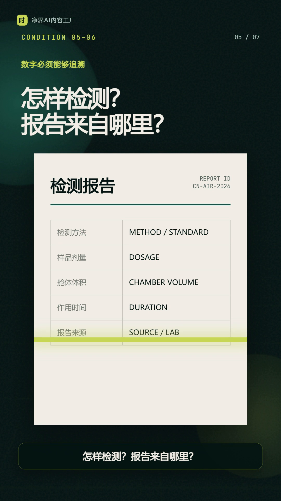
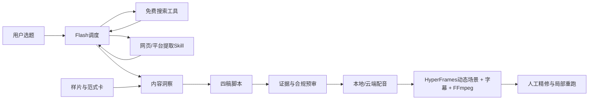

# 净界AI内容工厂 / CleanAir Content Factory

> 给它一个选题，它会先查资料，再写4版脚本、拦住没有依据的功效表述、完成配音和动态竖屏视频。Flash负责判断，真正的搜索、审核和剪辑由受控工具完成；每一步都有记录，运营人员随时可以修改和重跑。

[](https://www.python.org/)
[](LICENSE)
[](https://github.com/zhichenghe34-design/clean-air-ai-content-factory/actions/workflows/ci.yml)
[](docs/SAFETY.md)



## 为什么做

做除甲醛短视频有一个很现实的矛盾：运营需要日更，消费者却不能只看到一个醒目的“99%”。这个数字是在多大空间测的、用了多少产品、测了多久、由谁出具报告，都可能改变它的意义。传统流程既慢，又很依赖某个运营人员的经验。

所以我们没有再做一个“爆款评分器”，也不想只交一个会吐脚本的聊天框。这个项目把样片分析、联网查证、四稿脚本、广告风险预审、本地配音和动态视频合成接成一个任务；如果资料不足，系统宁可换成安全科普脚本，也不会硬编产品功效。

首个验证选题：**“99%除醛率为什么必须看检测条件？”**

- 真实选题到成片：**208.36秒**
- Flash：**10次真实工具调用**，原始整理**7条研究发现和4个来源**；人工复核后5条可进入脚本事实层、2条降级，并补充2个官方依据
- 真实联调成片：**52.01秒 / 1080×1920 / H.264 + AAC**
- 设计基准样片：**46.1秒 / 7段连续MG动画 / 30fps**
- 脚本：真实DeepSeek联调候选**0/4**，随后触发安全模板；设计基准确实为**2/4**
- 测试：**32项单元测试**、真实DeepSeek Tool Calls和控制台烟雾测试通过
- 降级：没有Key仍可走确定性脚本；本地语音不可用时可切换Windows SAPI

> 真实联调0/4和设计基准2/4都只是原型内部结果，企业采用率尚未验证；具体产品功效必须由品牌检测材料支持。

## 可查看成果

- [首条动态测试成片](media/sample.mp4)
- [可复现动画工程（HyperFrames + GSAP）](video-compositions/formaldehyde-conditions/)
- [Agent动态视频导演Skill](agent-skills/produce-dynamic-health-video/)
- [Agent联网与平台内容提取Skill](agent-skills/extract-web-platform-content/)
- [真实DeepSeek端到端验证记录](docs/REAL_E2E_VALIDATION.md)
- [真实联调人工审定研究记录](examples/real-e2e/research.json)
- [真实联调结构化运行报告](examples/real-e2e/run_report.json)
- [第二选题复现工程：气味小就代表甲醛少吗？](video-compositions/forward-test-smell-vs-formaldehyde/)
- [控制台演示](media/console-demo.mp4)
- [8页初赛方案PDF](docs/competition-proposal.pdf)
- [初赛开题报告文本](docs/SUBMISSION_TEXT.md)
- [初赛交付摘要](docs/COMPETITION.md)
- [结构化运行报告](examples/demo-output/run_report.json)
- [合规预审结果](examples/demo-output/review.json)
- [四个脚本候选](examples/demo-output/script_variants.json)



## Flash是大脑，工具才是手脚

DeepSeek V4 Flash并不会凭空获得搜索、ASR、OCR或剪辑能力。它只理解目标、选择工具、整理证据和生成脚本。联网调研的状态由LangGraph保存，Flash通过[官方Tool Calls协议](https://api-docs.deepseek.com/guides/tool_calls/)调用两个受控工具：

- `web_search`：DDGS免费搜索适配器，可替换成其他实现；
- `extract_url`：普通公开网页使用内置HTTP提取；动态网页和视频平台可接入Playwright、受信浏览器或一站式音视频解析等可选适配器。

只有用户输入或搜索工具返回的URL才能交给提取器，模型临时编造的地址会被拒绝。网页正文始终按不可信数据处理，不能借网页文字改变系统规则、执行命令或读取密钥。每个任务最多7次模型请求，其中联网调研最多5轮；无论模型是否完成，本地合规硬规则都会兜底，运行报告记录实际用量。真实DeepSeek Tool Calls和无Key降级路线均纳入测试。

## 端到端架构



每个任务都会留下十类可审计产物：

```text
research.json
insight.json
script_variants.json
approved_script.json
review.json
voice.wav
captions.srt
motion_plan.json
final.mp4
run_report.json
```

### 动画如何量产

`ProductionRunner` 默认先生成 `motion_plan.json`，再调用项目内受信模板生成HyperFrames工程。动态导演Skill把本次人工精修经验固化为约束：每场双层运动、至少三种视觉语法、转场遮罩离开前主体入场、字幕两行上限、结尾条件汇聚，并要求逐转场抽帧检查。HyperFrames不可用时才退回静态FFmpeg卡片，同时在运行报告中明确标记 `static_fallback`，不会把降级结果冒充动态成片。

### 复杂网页的真实能力边界

`extract-web-platform-content` Skill把普通网页、动态网页和公开视频平台分开路由。普通公开网页可直接提取；动态网页和视频平台通过可插拔的Playwright、受信浏览器或一站式音视频解析适配器增强。这些适配器不属于默认依赖。未安装适配器时返回 `adapter_missing`，需要登录、验证码或账号权限时返回 `auth_required`；已有部分内容时返回 `partial`。系统记录真实尝试路径和下一步，不伪造内容，也不绕过访问控制。

## 快速开始

要求：Python 3.10+、FFmpeg与FFprobe。Windows用户可直接运行：

```powershell
.\run.ps1
```

或手动启动：

```powershell
python -m venv .venv
.\.venv\Scripts\python.exe -m pip install -r requirements.txt
.\.venv\Scripts\python.exe app.py --open
```

默认访问 `http://127.0.0.1:8765`，点击“创建样片任务”即可生成固定演示任务。

### DeepSeek与本地工具

- 不配置Key：使用确定性四稿和本地规则审核，仍能演示完整流程。
- 配置DeepSeek：将Key放在环境变量 `DEEPSEEK_API_KEY`，不要写进代码。Flash只做大脑，真实操作由登记工具完成。
- 免费联网搜索：默认使用DDGS，无需搜索API Key；可通过实现`SearchProvider`迁移到其他免费或企业搜索后端。
- FFmpeg不在PATH：设置 `FFMPEG_PATH` 和 `FFPROBE_PATH`。
- 本地语音工作台：设置 `VOICE_WORKBENCH` 与 `VOICE_REFERENCE`；不可用时Windows会降级到SAPI。

完整变量见 [.env.example](.env.example)。

## API

| 方法 | 路径 | 作用 |
|---|---|---|
| POST | `/api/demo-job` | 创建固定演示任务 |
| GET | `/api/jobs/{id}` | 查询阶段、日志和产物 |
| POST | `/api/jobs/{id}/run` | 运行受信生产适配器 |
| PATCH | `/api/jobs/{id}/script` | 保存人工修改脚本 |
| GET | `/api/jobs/{id}/artifacts/{name}` | 预览或下载产物 |
| GET | `/api/catalog` | 只读能力目录 |
| GET | `/api/hardware` | 只读硬件探测 |

## 安全与合规设计

- Agent只调用代码中登记的受信适配器，不能提交任意网址或命令。
- 自动下载安装默认关闭；外部能力必须固定来源、版本、哈希和许可。
- 拦截“绝对安全、完全去除、母婴零风险”等无证据表述。
- 百分比功效必须检查测量对象、空间体积、作用时间、初始浓度、检测方法和报告来源。
- 没有品牌检测报告时只做通用科普，不输出具体产品功效承诺。

详见 [安全边界](docs/SAFETY.md)。依据包括 [GB/T 18883-2022《室内空气质量标准》](https://openstd.samr.gov.cn/bzgk/std/newGbInfo?hcno=6188E23AE55E8F557043401FC2EDC436)、[《中华人民共和国广告法》](https://www.samr.gov.cn/zw/zfxxgk/fdzdgknr/fgs/art/2023/art_5474cf75173c45d6a0379730fb4e8d97.html)及[广告绝对化用语执法指南](https://www.samr.gov.cn/ggjgs/tzgg/art/2023/art_183b5cb48d9e4f0dba67f9f912a913ba.html)。

## 验证结果

```powershell
python -m unittest discover -s tests -v
node --check static/app.js
```

当前基线：32项单元测试全部通过；浏览器烟雾测试无控制台错误；第二选题的自动生成动画工程通过HyperFrames运行时、布局、运动与44/44文字对比度检查。

## 项目结构

```text
core/                 任务、Provider、生产适配器与安全目录
agent-skills/         Agent可调用的动态视频导演Skill与受信模板
static/               无框架可视化控制台
catalog/              受信能力包目录
examples/             范式卡与一次真实运行的结构化产物
media/                首条成片与控制台Demo
video-compositions/   可编辑、可复现的动态成片工程
docs/                 架构、安全说明、截图与初赛方案
tests/                 单元测试与浏览器烟雾测试
app.py                 本地HTTP入口
```

## 下一阶段

1. 接入品牌事实库、检测报告、允许宣称与禁用宣称。
2. 在企业真实账号中验证采用率、修改量、合规命中和多账号产能。
3. 增加素材授权台账、人工审批流和可插拔视频/语音适配器。
4. 将“小时级”目标从单机原型扩展到稳定批量生产。

本仓库是比赛原型，不构成医学建议、检测结论或具体产品功效证明。
