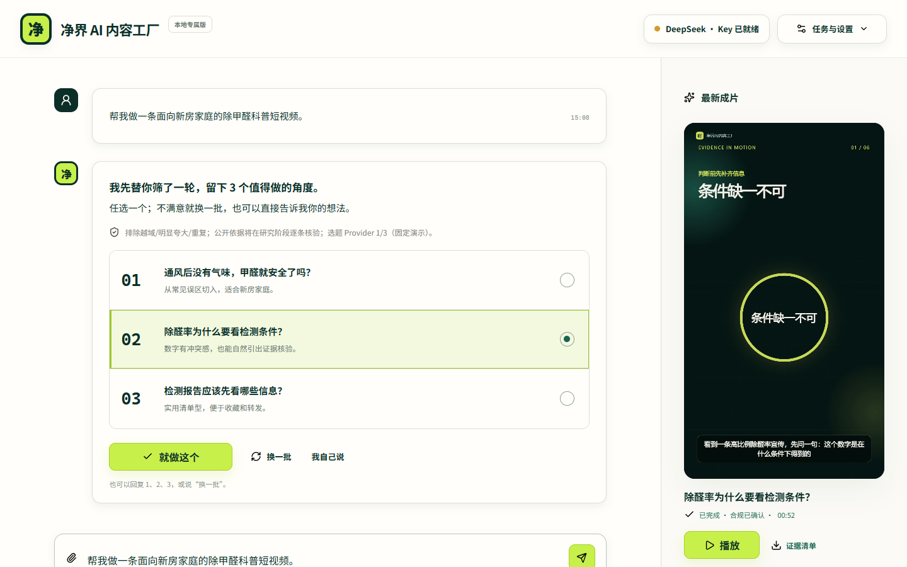
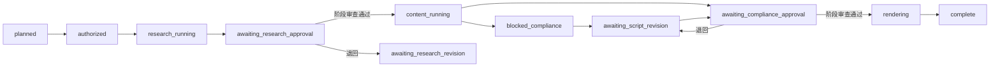

# 时宜 Agent 内容工厂 v0.3（纯动画主线开发候选）

一个可运行、可审核、可积累纠错经验的短视频内容工厂。计划中的 v0.3 正式主链先从本地确定性安全能力包出发，再完成三选一、研究、脚本、合规和成片。两道哈希门禁始终保留：正式模式由用户审核；受控测试模式由 Codex 通过本地浏览器逐项审查，记录明确标为 `test_only`，最终成片再交给用户验收和反馈。默认生产模式现为本地纯动画：由固定 HyperFrames 0.7.86、可信动画积木注册表和 Noto Sans SC 组成；MoneyPrinterTurbo 1.3.3 保留为实拍素材支线。我们的控制层继续负责证据、审查、预算、运行隔离、媒体复验和最终 manifest。

[](https://www.python.org/)
[](LICENSE)
[](https://github.com/zhichenghe34-design/clean-air-ai-content-factory/actions/workflows/ci.yml)
[](https://github.com/zhichenghe34-design/clean-air-ai-content-factory/releases/tag/v0.2.0)

| 版本 | 当前状态 | 可下载 |
|---|---|---|
| v0.2.0 | 当前稳定发布 | 是 |
| v0.3.0 纯动画主线组合版 | 开发候选；每个候选必须单独通过封包、冷启动和纯动画 E2E，精确结果见项目发布闭环记录 | 否 |

## Windows 一键体验（当前稳定版 v0.2.0）

不懂 Python、Node.js 或 FFmpeg，也可以直接使用已经封装并完成全新解压验证的 Windows 便携版：

**[下载净界 AI 内容工厂 v0.2.0 Windows 便携版](https://github.com/zhichenghe34-design/clean-air-ai-content-factory/releases/download/v0.2.0/ShiyiContentFactory-v0.2.0-Windows-x64.zip)**

下载后完整解压，双击 `启动净界AI内容工厂.bat`。软件只监听本机 `127.0.0.1`；包内不含 API Key、Cookie 或个人配置。

- 版本：`v0.2.0`
- ZIP 大小：390,125,769 字节（约 372.1 MiB）
- SHA-256：`F074B7D1BBC7C0F1262CBB5514A15B9782DBA1EACEBFC9B03C8275E9A1A539EB`
- 验收：74 项 Python 测试、npm audit 0 漏洞、封装 EXE HTTP、HyperFrames 运行时及 H.264/AAC 实编码均通过

便携包中的 FFmpeg 为包含 `libx264` 的 GPLv3 构建，许可证和构建信息随包提供。仓库自身代码仍按 [MIT License](LICENSE) 发布；正式再分发便携包时请同时遵守其中第三方组件的许可证义务。



> 当前截图、比赛 PDF、设计样片和真实 DeepSeek 证据包属于“净界除甲醛 v2”历史比赛基线，只证明该行业包的既有运行结果，不冒充通用 v3 的新联调证据。v3 视觉重设计尚未开始。

默认首页采用 Agent 优先的轻交互：用户描述行业、受众和内容目标，系统使用带 SHA-256 的确定性安全能力包，并在每轮只给 3 个角度。选定后系统自动推进，只在“研究证据审查”和“最终脚本审查”两处停下。候选只是研究方向，不代表事实已经成立；严格反证和阶段审查仍在任务链内执行。正式模式由用户操作两处门禁；受控测试模式由 Codex 打开详细依据、通过浏览器操作两处门禁，用户只测试最终成片并反馈。任务进行中可以继续输入纠错；当前界面先采用“安全阶段应用”的默认方式，显式“打断/不打断”双模式延期。

## v3 通用内核新增

- 正式路径不再被动态 schema 阻断：每个目标先使用本地确定性安全能力包；有 Key 时只请求一次三个候选，无 Key、Provider 失败或预任务额度耗尽时返回同目标的本地安全候选。
- 动态行业能力包生成与启动阶段反证协议仍保留为实验能力，只能通过 `SHIYI_EXPERIMENTAL_DYNAMIC_TOPICS=1` 在开发验证中启用，不属于 v0.3 正式发布主链，也不充当成功证据。
- “13 个本地工具能力包”仅指 v2 冻结目录中的本机工具登记；“动态行业能力包”是 v3 按任务现场生成的声明式行业约束，两者不互相计数或互相证明。
- 能力包只保存行业、受众、平台、语气、证据要求、禁用主张和视觉方向等声明式约束，禁止脚本、命令、密钥和任意 URL；每个不可变版本进入独立注册表并可按哈希追溯。
- 普通网页不能靠模型自报 `source_type` 冒充政府或机构来源；来源类型由实际 URL 在本地重新分类，能力包和历史记忆都不能充当事实证据。
- 工作人员纠错采用追加式事件记录，并编译为 task、project 或 workspace 作用域的收紧规则；纠错不会代替任务授权，也不会覆盖上一份成功产物。
- 同一条非任务规则在 3 个不同成功任务中被验证后，才会原子生成 instruction-only Skill；重复任务不凑数，Skill 不包含命令、脚本、URL或密钥。
- 原净界逻辑被收进显式 `legacy-clean-air-v2` 能力包。历史任务不改写，旧证据、成片和审批哈希继续保持原用途。

## 纯动画主线与实拍支线

- 新任务的默认 `production_mode` 是 `motion`：审批后的脚本会被拆成 4—8 幕，再从本地 `shiyi-animation-pack-v1` 白名单中按语义选择积木。当前基础包包含 36 个积木、12 个明确 renderer family，每个 family 有 3 个可见变体；积木版本、行业模式、逐幕匹配和选择收据都由 SHA-256 绑定。
- 动画模板只使用本地有限 WAAPI、Noto Sans SC 与确定性时间线；不使用 CDN、运行时下载、随机数、无限循环或现场生成可执行代码。HyperFrames 正式检查使用 `--strict`，正式渲染使用 `--no-best-effort --strict`。
- 当前 45 秒自然中文七幕 canary 已通过 HyperFrames 0.7.86 的 lint、runtime、layout、motion 和 contrast 严格检查，包含 300 个运动采样；这只证明动画工程合同，不冒充两道阶段审查后的正式成片 E2E。
- `footage` 保留为 MoneyPrinterTurbo 实拍支线；旧 MPT 任务不会被默认动画路由改写。`hybrid` 当前明确 fail-closed，`simple` 仅用于不可发布的诊断运行。
- 便携封包合同会固定 Node、HyperFrames、Chrome Headless Shell、字体和 FFmpeg，禁止系统 PATH、`npx`、运行时下载及宿主 Node 注入。当前 135 个可达依赖的许可证闭包已经完成，9 个缺少包内正文的精确版本 override 也已绑定官方来源；每个候选都必须从对应 clean commit 重建并在全新目录冷启动，不能只凭源码测试宣称可下载。

- MoneyPrinterTurbo 固定为 `1.3.3` / `254cd028906ee657eab844dc94087cdbea2a7aa8`，通过只监听回环地址的内部 HTTP API 接收已经批准的脚本和本地素材；它不能读取 DeepSeek Key，也不能重写事实内容。
- 固定脚本的独立 CLI 烟雾和真实 HTTP → `ProductionRunner` 联调均已通过。CLI 证据 manifest SHA-256 为 `D184B944BEF773A17790F264ADEC01D3F838AC3B411CF83F829FABEBD4B87E5E`；HTTP 组合成片为 46.600 秒、1080×1920、H.264/yuv420p + AAC，证据 manifest SHA-256 为 `F42EA0D748B7E15287978462112E7481E8F9CB80FBBF015B70ACE183204DB64F`。这些都只属于内部工程证据，不冒充用户两道人审后的正式比赛证据。
- 引擎输出先进入当前运行 staging。控制层重新校验时长、分辨率、编解码、字幕连续性与哈希；全部通过后，才把 `material_sources.json`、`engine_report.json` 和标准产物写进成功 manifest。失败不会替换上一成功运行。
- 封包构建器限定使用项目核验过的 Noto Sans SC、本地 MP4 和无 BGM 策略；不采用上游字体、歌曲、WebUI、LLM 或社交发布功能。v0.3 保持候选且不由 README 预声明发布；精确提交、包哈希、E2E 与用户验收状态记录在项目发布闭环中，边界见 [生产引擎组合说明](docs/PRODUCTION_ENGINE_INTEGRATION.md)。

## 保留的 v2 安全与发布基线

- 状态严格分为执行授权、研究、研究阶段审查、内容生成、合规阻断/阶段放行、渲染和完成；测试代理审查与正式人审使用不可混淆的结构化身份，自动系统不再伪装成人工审核。
- 每次推进使用独立 `run_id` 和 staging。失败尝试不会替换上一份成功成片，正式产物只从成功 manifest 解析。
- 严格反证审核先逐项判定 finding；正式人审可从首页确认，代理测试审查必须进入详细页逐项检查后提交。文件哈希变化后原阶段审查立即失效。
- 医疗因果、健康保证、绝对化表达及没有已批准证据支持的功效数字由本地规则阻断；自动通过后仍须经过当前任务固定的阶段审查门禁，代理测试模式也不能放行阻断脚本。
- 同任务有进程锁和 PID 磁盘锁；同一次浏览器动作遇到网络结果不确定时使用同一个 `Idempotency-Key` 自动重放，用户明确点击重试则生成新 Key，并发点击仍只执行一次。生产网络尝试在发出前计入每任务共享的 7 次硬预算，并在请求离开进程前通过 `fsync` 与原子替换持久化；崩溃恢复不会返还已经预留的额度。
- 服务只监听 `127.0.0.1`。写接口要求随机会话 Cookie、CSRF、JSON Content-Type 和当前端口同源 Origin。
- Provider 正式模式只接受 `https://api.deepseek.com` 或 `/v1`；每个最终响应和重定向 URL 还必须使用登记的模型/对话路径，且不得携带 userinfo、query 或 fragment。localhost 仅在 `SHIYI_ALLOW_TEST_PROVIDER=1` 时开放。
- 预任务选题与 Agent 计划共用独立的本机会话 Provider 账本，硬上限 3 次；成功、失败、超时和结构化响应无效都如实计入 attempted/failed。耗尽后只使用本地安全候选或计划，不占任何已创建任务的 7 次生产预算。
- Windows 持久化 Key 使用当前用户 DPAPI；非 Windows 只使用环境变量或当前进程会话。

旧任务不会重写，GET 时统一显示为 `legacy_read_only`，也不能通过 v2 正式产物接口访问旧报告。2026-07-18 的旧真实联调材料保留在 `examples/real-e2e/` 并明确标记为 legacy；2026-08-01 的 v2 联调由用户亲自完成两道人工作业门禁，公开证据包位于 `evidence/v2-real-deepseek-20260801-022153/`。

## 开发启动（仅工作台）

需要 Python 3.12 或 3.14、Node.js、FFmpeg/FFprobe。HyperFrames 使用锁定依赖，运行时不会通过 `npx --yes` 临时下载。

```powershell
python -m venv .venv
.\.venv\Scripts\python.exe -m pip install -r requirements.txt -r requirements-dev.txt
npm.cmd ci
.\.venv\Scripts\python.exe app.py --host 127.0.0.1 --port 8765 --open
```

默认地址是 `http://127.0.0.1:8765`。如果 8765 被占用，程序只在 127.0.0.1 上顺延寻找端口，控制台会显示实际端口。

这条命令只启动工作台源码，不会自动启动动画或实拍引擎。v0.3 组合开发环境使用 `scripts/launch_combined.ps1`：固定动画运行时通过探针后成为默认生产引擎；MPT 可作为实拍支线启动，缺失或崩溃时只撤销实拍健康状态，不阻断动画工作台。最终便携包会把所需运行时和根目录双击入口一并封装，运行时不会下载依赖。

受控测试时显式增加 `-AgentTestReview`。启动器默认清除父进程遗留的测试开关，只有本次显式参数才会把 `SHIYI_AGENT_TEST_REVIEW=1` 传给工作台；MoneyPrinterTurbo 不会收到这个标志。新任务会固定 `review_policy.stage_review_mode=agent_test`，两道记录均写明 `actor_type=agent`、`review_mode=test`、`human_approval_claimed=false`，最终 manifest 标为 `test_only_pending_human_acceptance`。普通启动仍固定为正式人审模式。

```powershell
.\scripts\launch_combined.ps1 -AgentTestReview
```

API Key 推荐放在环境变量：

```powershell
$env:DEEPSEEK_API_KEY = "你的Key"
```

也可以在控制台只用于当前会话；勾选本机保存时，Windows 使用 DPAPI 加密。Key 不进入代码、任务产物、公开证据或日志。

顶部状态只说明已经验证到哪一步：保存或读取到 Key 时显示“Key 已就绪”；只有当前进程内的连通测试成功后才显示“本次连接已验证”。配置或 Key 变化后，旧验证状态立即失效。

## v2 状态机



失败记录保留实际阶段、错误与失败目录；重跑创建新的 `run_id`。研究和内容阶段的成功运行属于审计历史，只有成功 render 运行能成为 `current_run_id`。

## 产物与证据

每次最终成功运行包含十项规范产物，并增加审批与清单。纯动画成功运行还必须纳入接触表和视觉门禁，共 14 项；公开包再加入机器复算说明，共 15 项。MPT 实拍公开包同样是 15 项，但其两项专属证据是素材来源与引擎报告，不能与纯动画视觉证据互相替代：

```text
research.json             insight.json
script_variants.json      approved_script.json
review.json               voice.wav
captions.srt              motion_plan.json
final.mp4                 run_report.json
approvals.json            manifest.json
VALIDATION.md（仅公开包）
contact-sheet.png（纯动画运行）
visual-qc.json（纯动画运行）
material_sources.json（MPT 实拍运行）
engine_report.json（MPT 实拍运行）
```

`manifest.json` 记录输入哈希、两道审批哈希、开始/结束时间、预算，以及每个文件的 MIME、字节数和 SHA-256。历史成功产物使用带 `run_id` 的只读地址；失败 staging 和未入清单文件不对外提供。

## 主要 API

所有 POST/PATCH 先访问 `GET /api/session` 取得 CSRF，并携带会话 Cookie、`X-Shiyi-CSRF`、`Content-Type: application/json` 与当前端口同源 Origin。

| 方法 | 路径 | 作用 |
|---|---|---|
| POST | `/api/agent/topics` | 使用确定性安全能力包返回恰好 3 个候选；有 Key 时只请求一次候选，Provider 不可用时使用同目标的本地安全候选 |
| POST | `/api/agent/plan` | 生成预任务执行计划；与选题共用会话 3 次额度，失败或耗尽时返回本地安全计划 |
| POST | `/api/demo-job` | 以能力包不可变快照创建任务 |
| POST | `/api/agent/corrections` | 记录工作人员纠错，生成带作用域的安全规则并在当前或下一安全阶段应用 |
| GET | `/api/learning` | 查看纠错事件和已经验证生成的本地 Skills |
| GET | `/api/capability-packs` | 查看已发布能力包的脱敏摘要与历史版本数 |
| POST | `/api/jobs/{id}/approve` | 首次执行授权 |
| POST | `/api/jobs/{id}/run` | 只推进到下一道阶段审查门禁，要求 `Idempotency-Key` |
| POST | `/api/jobs/{id}/approvals/research` | 研究逐 finding 审定 |
| POST | `/api/jobs/{id}/approvals/compliance` | 最终脚本合规放行 |
| PATCH | `/api/jobs/{id}/script` | 人工改稿并重算本地合规/时长 |
| GET | `/api/jobs/{id}/review-artifacts/{name}` | 读取当前待审文件 |
| GET | `/api/jobs/{id}/artifacts/{name}` | 读取当前成功 manifest 产物 |
| GET | `/api/jobs/{id}/runs/{run_id}/artifacts/{name}` | 读取历史成功运行产物 |

`/api/agent/topics` 请求体为 `{ "goal": "4-200 字内容目标", "excluded_topics": [] }`，刷新时可把上次响应的 `capability_pack` 原样带回。`excluded_topics` 只能缺省或为数组，最多 24 个且每项为不超过 80 字的字符串；`false`、`0`、空字符串和 `null` 均返回 JSON 422。响应中的 `candidates` 始终为三个 `{id, title, reason, audience}`，同时返回确定性能力包、脱敏项目上下文、已生效记忆和真实预算；正式路径的启动阶段反证字段明确为 `not_run`，不会伪造自动通过。候选筛选不冒充研究证据核验；个性化医疗/投资/高风险法律决策、恶意任务和指令注入会返回 JSON 422。

`/api/agent/plan` 请求体为 `{ "goal": "任务目标" }`，响应始终包含 `plan`、`fallback`、`source`、`notice` 和同一份 `pretask_provider_budget`。Provider 返回 HTTP 200 但缺少消息、结构化 JSON 无效或计划调用失败时，会把该次 attempted 从 succeeded 纠正为 failed 并记录失败类型，然后安全降级，不会返回虚假的成功统计。

## 联网与本地能力边界

DeepSeek 只能调用代码登记的 `web_search` 与 `extract_url`，不能执行网页指令或生成下载命令。普通公开网页走受限 HTTP；已安装的 Playwright 或一站式音视频解析器是可选适配器。登录、验证码或账号权限场景不会自动接管账号，当前实现返回明确的适配器状态与人工下一步，不承诺未实现的登录态浏览器。

解析器使用字段白名单生成一次性配置，`key/token/secret/password/cookie/authorization` 不会复制到任务目录。HyperFrames 版本锁定在 `package-lock.json`；缺失时返回适配器未安装，不在运行时自动下载。

## 验证

```powershell
.\.venv\Scripts\python.exe -B -m unittest discover -s tests -v
npm.cmd run check:js
npm.cmd audit --audit-level=low
npm.cmd run test:smoke
npm.cmd run test:flow
.\.venv\Scripts\python.exe tools\check_submission_consistency.py --check-rebuild
.\.venv\Scripts\python.exe tools\verify_public_evidence.py evidence\v2-real-deepseek-20260801-022153
.\.venv\Scripts\python.exe tools\verify_committed_media.py
```

Python 测试由 `unittest discover` 动态发现，当前 328 项 Python 测试同时覆盖 v2 状态/审批/预算/并发/密钥回归，v3 通用 Agent 与纠错学习，以及纯动画生产模式、动画注册表与选择收据、HyperFrames 固定身份和离线依赖合同、MoneyPrinterTurbo 实拍适配器、结构化人审/代理测试身份绑定、失败运行隔离、正式成片视觉门禁、Windows 一键启动和确定性便携包完整性。浏览器烟雾测试继续覆盖 Provider 三态、“恰好 3 个候选、恰好 1 个选中”、中文审核解释、换一批、自定义输入、代理测试必须进入详细页、两道门禁不静默代批、窄屏无溢出与零前端错误。CI 使用不可发布的注入式假配音/渲染适配器完成快速确定性 E2E。

## v2 历史比赛材料（只读基线）

- [动态测试成片](media/sample.mp4)
- [v3 通用 Agent 内核说明](docs/GENERAL_AGENT_KERNEL.md)
- [Agent 工作台演示](media/agent-workbench-demo.mp4)
- [可复现动画工程](video-compositions/formaldehyde-conditions/)
- [第二选题工程](video-compositions/forward-test-smell-vs-formaldehyde/)
- [v2 架构](docs/ARCHITECTURE.md)
- [Agent 工作台视觉规范](docs/DESIGN_CONSTITUTION.md)
- [安全边界](docs/SAFETY.md)
- [v2 真实联调与 legacy 对照记录](docs/REAL_E2E_VALIDATION.md)
- [v2 完整脱敏证据包](evidence/v2-real-deepseek-20260801-022153/)
- [v2 Agent 工作台补充材料 PDF](docs/competition-proposal.pdf)

本仓库仍处于原型阶段，不构成医学、投资或法律建议，也不构成任何产品功效、业绩、认证或排名证明。真实品牌宣称必须回指可核验材料并由相应负责人确认。
