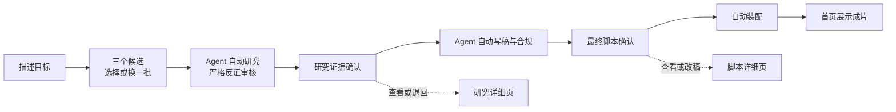

# 净界 AI 内容工厂视觉宪法 v1

> 状态：已由用户审定并实施为 Agent 三选一工作台；本文件同时作为后续迭代与发布截图的持续验收基线。
>
> 适用范围：本地控制台、比赛截图、演示录屏、补充材料中的界面画面。
>
> 核心要求：先保证可信、清楚和完整，再追求展示效果；所有美术元素必须来自同一套语义，不使用来源不明的素材包。

## 1. 设计命题

净界不是“绿色环保后台”，而是把原始信息送入证据流程、过滤不可信结论、最终产出可追溯成片的研究制片系统。

视觉母题固定为：

> **证据轨道 + 人工闸门 + 9:16 成片框**

界面气质固定为：

> **洁净、精密、克制、可验证、有推进感。**

需要借鉴游戏 UI 的任务聚焦、空间导航、状态反馈和阶段揭示，不复制任何具体游戏的 HUD、图标、边框、贴图或音效。

## 2. 不可变原则

1. 一屏只承担一个主要任务，一屏只有一个高权重主操作。
2. 操作员不需要同时理解整个系统；细节按需进入抽屉、档案页或系统舱。
3. 自动判断、人工决定、运行状态和最终结果必须在颜色、形状和文字上同时可区分。
4. 美术效果不能掩盖合规阻断、审批责任、预算和证据来源。
5. 颜色、图标、纹理和动效不能作为唯一信息载体。
6. 外部字体、图标和素材必须有官方来源、明确许可证、固定版本和 SHA-256。
7. 正式项目不得包含个人免费字体、来源不明图标、游戏截图裁片或未经核验的素材包。

## 3. 人与机器的双层视觉语言

| 维度 | 人读的内容世界 | 机器运行的系统世界 |
|---|---|---|
| 内容 | 选题、证据解释、脚本、审批意见 | 哈希、预算、模型、时间、日志 |
| 字体 | Noto Sans SC | JetBrains Mono |
| 基底 | 暖象牙白、安静、可阅读 | 墨林深绿、精密、低眩光 |
| 几何 | 大矩形、宽松留白、柔和圆角 | 轨道、节点、刻度、细线 |
| 纹理 | 极轻的纸张或印刷颗粒 | 极轻的校准网格或定位标记 |
| 动作 | 展开、批注、确认、锁定 | 扫描、推进、校验、归档 |

青柠色的证据轨道连接两个世界。它表示“行动、焦点和系统正在推进”，不表示“审核通过”。

## 4. 颜色系统

### 4.1 基础色板

| 令牌 | 色值 | 用途 |
|---|---:|---|
| `canvas-warm` | `#F7F5EE` | 页面主背景 |
| `surface-paper` | `#FFFEFA` | 正文、输入、审批内容表面 |
| `ink-forest` | `#0B2F28` | 主文字、深色锚点、视频环境 |
| `brand-forest` | `#17634F` | 主按钮、导航选中、重要结构 |
| `signal-lime` | `#C8F04A` | 当前步骤、焦点、主要行动提示 |
| `text-muted` | `#5F6D68` | 辅助说明、时间、弱信息 |
| `line-soft` | `#D8DED8` | 分隔、表格、轻边界 |

使用比例约为：70% 暖色中性背景、25% 深绿结构、最多 5% 青柠和事件状态色。

### 4.2 状态色

| 状态 | 文字/图标 | 浅背景 | 必须同时显示的文字 |
|---|---:|---:|---|
| 运行中 | `#235D9F` | `#E8F1FC` | 正在运行 |
| 等待人工 | `#7A4B00` | `#FFF3D4` | 等待人工确认 |
| 已通过 | `#146A4B` | `#E3F4EC` | 已通过 |
| 已阻断 | `#9F2D20` | `#FCE9E5` | 已阻断及原因 |
| 未开始 | `#5F6D68` | `#EEF1EE` | 未开始 |

### 4.3 对比度基线

- `#0B2F28` / `#F7F5EE`：13.26:1。
- `#FFFFFF` / `#17634F`：7.16:1。
- `#0B2F28` / `#C8F04A`：11.04:1。
- `#5F6D68` / `#F7F5EE`：4.97:1。
- `#C8F04A` / `#F7F5EE`：1.20:1，禁止作为浅底正文颜色。

正文以 4.5:1 为最低目标，大字号和非文字控件不得低于 3:1。

## 5. 几何与空间

### 5.1 形状语义

| 几何元素 | 固定含义 | 允许用途 |
|---|---|---|
| 点与圆 | 状态、当前所在位置、运行生命 | 流程节点、在线状态、进度 |
| 线与轨道 | 时间、因果、方向 | 研究到交付的生产路径 |
| 大矩形 | 可读、可编辑的内容对象 | 选题、证据、脚本、报告 |
| 双边框/闸门 | 不可跳过的人工决定 | 研究审批、最终合规审批 |
| 9:16 竖框 | 最终目标和视觉焦点 | 成片预览、渲染结果 |
| 大面积留白 | 当前内容的优先级 | 主任务周围，不填充装饰 |

不把六边形、菱形、倾斜面板或圆角卡片墙当作“科技感”。同一种形状必须表达相同的操作或状态。

### 5.2 空间层级

每个场景最多三层：

1. 基础环境：页面背景和全局导航。
2. 当前工作场景：本页唯一主任务。
3. 临时层：抽屉、人工闸门或错误解释。

常规桌面场景采用约 8:4 的不对称分区：三分之二用于当前操作，三分之一用于结果预览或必要上下文。移动端按内容顺序纵向重排，不缩成密集小卡。

## 6. Agent 主流程与详细工作区

正式首页不再把全部工序作为同级导航。用户只需要描述目标、三选一并在两处人工门禁确认；Agent 负责其余推进。任务档案、逐 finding 审定、改稿、预算和运行历史属于按需进入的详细工作区：

Provider、密钥、本地工具、能力包和安装位置归入二级“系统舱”，不占据生产主路径。详细页可以保留完整的状态机操作，但不得在首页恢复一排同等优先级的工序按钮。

持续 HUD 只显示：任务名、当前阶段、预算、本地安全状态、前进/返回。其他信息按需进入详情。

## 7. 字体与排版

### 7.1 字体角色

- 人读内容：Noto Sans SC；PDF 固定嵌入仓库登记的 Regular/Bold 文件，UI 使用 Noto Sans SC 优先的安全字体栈。
- 机器数据：JetBrains Mono。
- 不引入第三套正式 UI 字体。
- 微软雅黑、苹方仅可作为系统回退名称，不得复制字体文件进仓库。

字体许可证：

- [Noto Sans SC（Google Fonts 官方仓库）](https://github.com/google/fonts/tree/main/ofl/notosanssc)，SIL OFL 1.1。
- [JetBrains Mono 官方仓库](https://github.com/JetBrains/JetBrainsMono)，SIL OFL 1.1。

正式分发必须锁定具体版本或提交、保存许可证并记录文件哈希。PDF 使用的 Noto Sans SC 静态实例记录在 `docs/fonts/SOURCE.md`；如需裁剪或改格式，必须继续遵守 OFL 的修改版本和 Reserved Font Name 条件。

### 7.2 字号层级

| 角色 | 字号 | 字重 | 建议行高 |
|---|---:|---:|---:|
| 场景主标题 | 44–52px | 800–900 | 1.10–1.18 |
| 页面标题 | 30–36px | 700 | 1.20–1.28 |
| 模块标题 | 20–24px | 700 | 1.30–1.40 |
| 关键正文 | 16–18px | 500 | 1.55–1.70 |
| 普通正文 | 15–16px | 400 | 1.60–1.75 |
| 按钮文字 | 14–16px | 600 | 1.20 |
| 辅助信息 | 12–13px | 400–500 | 1.45–1.60 |
| 哈希/运行数据 | 12–14px | 400–500 | 1.45–1.60 |

正文不低于 14px；研究说明和审核解释每行约 24–36 个中文字符。中文正文不人为拉大字距；只有短英文眉题、版本号和系统标签可以增加字距。预算、时间和哈希使用等宽数字或 `tabular-nums`。

## 8. 图标系统

默认图标库为 [Lucide](https://github.com/lucide-icons/lucide)，许可证为 ISC。Material Symbols（Apache 2.0）只作为缺失语义时的评估备选，不与 Lucide 大量混用。

统一规则：

- 基础画布 24×24，默认线宽约 1.75px。
- 小图标 16px，普通操作 20–24px，流程核心 28–32px。
- 保持圆角端点和圆角连接，默认只使用线性图标。
- 只有当前步骤可以进入青柠底色或实心容器。
- 同一阶段在导航、轨道、标题和运行记录中使用同一图标。
- 研究、审批、阻断等关键状态必须同时有图标和中文文字。
- 禁止 emoji、Unicode 符号、来源不明 SVG 和多套图标混搭。

## 9. 纹理、光影与媒体

### 9.1 允许的纹理

1. 人工内容表面：极轻纸张或印刷颗粒，建议视觉强度 2%–3%。
2. 机器运行表面：极细校准网格、刻度或定位标记，只用于深绿系统区域。
3. 证据锁定反馈：轨道收束、边框闭合、哈希显现，只在完成动作时出现。

脚本、证据正文和表单上不覆盖网格。纹理在普通观看距离下不应先于内容被注意到。

### 9.2 光影

- 阴影最多两个层级：浮起工作层、临时门禁层。
- 青柠辉光只用于当前节点和关键推进瞬间。
- 不给所有边框和按钮发光。
- 玻璃效果仅可用于短暂覆盖层，不作为全局卡片风格。

### 9.3 成片优先

9:16 真实成片预览是界面中颜色和图像最丰富的区域。其他区域必须克制，让成片成为视觉主角。不得用装饰图抢占成片的注意力。

## 10. 动效语法

动效只承担方向、因果、连续性和结果反馈，不作为持续装饰。

| 动作 | 视觉规则 | 时长建议 |
|---|---|---:|
| 按钮/悬停反馈 | 颜色或轻位移，不改变布局 | 120–180ms |
| 前进到下一场景 | 旧场景左退，新场景右入 | 240–320ms |
| 返回上一场景 | 与前进方向严格相反 | 240–320ms |
| 阶段完成 | 轨道点亮，任务标记移到下一节点 | 320–450ms |
| 人工门禁 | 主场景后退，审批层进入 | 360–520ms |
| 证据锁定 | 内容收束成带哈希的锁定标记 | 450–700ms |
| 成片揭示 | 9:16 预览扩大为视觉主角 | 450–700ms |
| 合规阻断 | 轨道停止并显示阻断线，不抖动 | 180–260ms |

同一时刻只能有一个主动吸引注意力的动效。必须支持 `prefers-reduced-motion`；减少动态效果时保留状态变化和文字反馈。

## 11. 资产许可与证据

字体、图标、纹理、图片、视频和音效进入正式项目之前，必须记录：

- 名称和用途；
- 官方来源；
- 固定版本或提交哈希；
- 许可证及许可证文件；
- 获取日期；
- 文件 SHA-256；
- 是否修改；
- 修改后名称与许可处理；
- 是否允许随项目、视频、PDF 和公开包分发。

优先使用 MIT、Apache-2.0、BSD、ISC、SIL OFL 或项目自行生成的资产。仅标注“免费”“可商用”但没有完整许可证的素材不进入仓库。本节是工程准入规则，不替代正式法律意见。

## 12. 明确禁止的风格

- 绿色环保叶片、水滴、地球和分子球的图标堆砌。
- 蓝紫渐变、满屏玻璃卡、六边形墙和无意义扫描线。
- 从游戏截图裁切 HUD、边框、图标、贴图或音效。
- 下载来源不明的“科幻 UI 素材包”或 Lottie 动效。
- 每块内容都做卡片、阴影、描边和纹理。
- 为了展示能力而把所有工具、指标、日志和审批同时放到首屏。
- 用青柠色表示审核通过，或只靠红绿区分关键状态。
- 用装饰性动效掩盖等待、失败、阻断和人工责任。

## 13. 持续视觉验收清单

每次改变正式 UI、比赛截图或演示录屏时，必须重新检查：

- [ ] 第一眼能看出当前任务和唯一主操作。
- [ ] 一屏只完成一件事，详细信息可以按需打开。
- [ ] 证据轨道、人工闸门和 9:16 成片框在流程中保持一致。
- [ ] 人读内容与机器数据在字体、表面和排版上可区分。
- [ ] 青柠面积受控，不承担“通过”语义。
- [ ] 等待人工、运行、通过、阻断不依赖颜色单独表达。
- [ ] 图标来自同一图标系统，笔画、尺寸和容器一致。
- [ ] 纹理在内容之后被感知，不降低正文对比度。
- [ ] 没有来源不明、个人免费或许可证缺失的资产。
- [ ] 所有外部资产有版本、许可证和 SHA-256 记录。
- [ ] 页面动效方向与流程方向一致，并支持减少动态效果。
- [ ] 1440×1024、1366×768、移动窄屏和投影截图均保持主任务清楚。
- [ ] 转为灰度后仍能区分标题、正文、操作和状态。
- [ ] 没有用美术包装弱化合规阻断或人工审批责任。

## 14. 已实施边界

当前已选定并实施“Agent 三选一工作台”方向。后续可以继续优化排版、响应式、状态反馈和微动效，但不得恢复多工序同级导航，也不得改变既有 v2 状态机、安全、预算、审批和产物访问逻辑。任何新的视觉资产进入发布前，仍须补齐官方来源、许可证、版本和 SHA-256。
